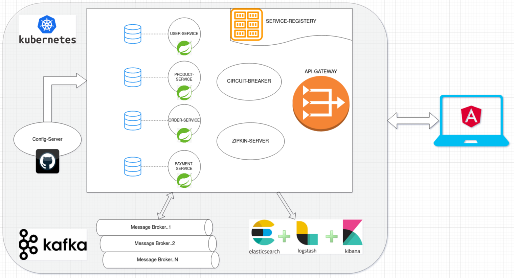
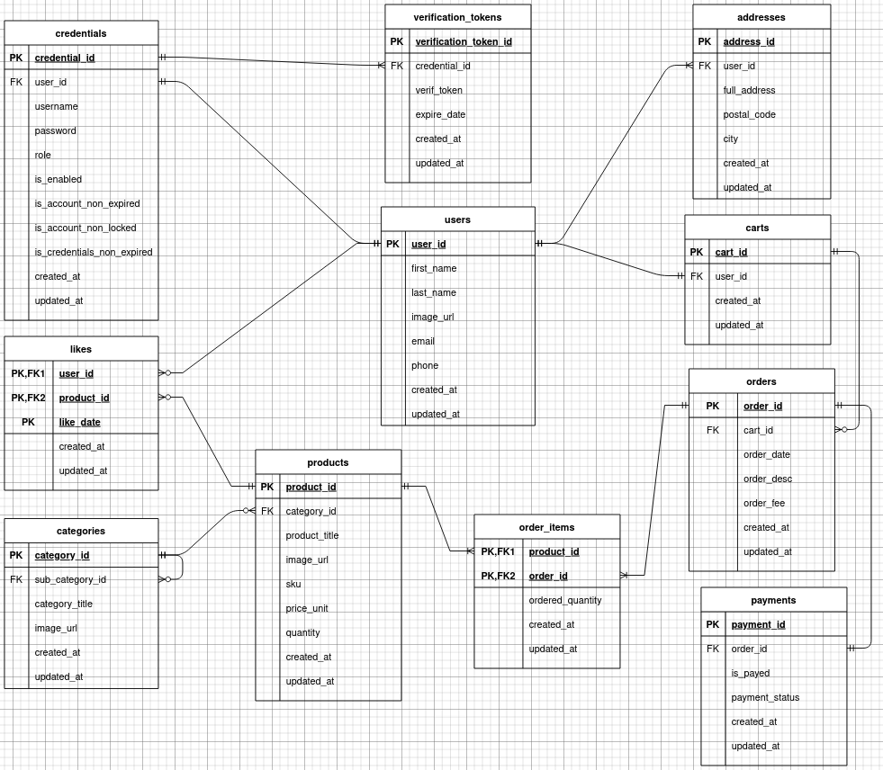
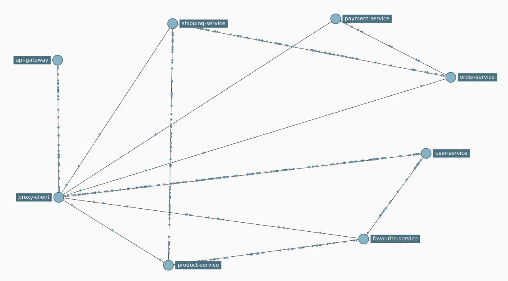

# e-Commerce-boot μServices 

## Important Note: This project's new milestone is to move The whole system to work on Kubernetes, so stay tuned.

<!--## Better Code Hub
I analysed this repository according to the clean code standards on [Better Code Hub](https://bettercodehub.com/) just to get an independent opinion of how bad the code is. Surprisingly, the compliance score is high!
-->
## Introduction
- This project is a development of a small set of **Spring Boot** and **Cloud** based Microservices projects that implement cloud-native intuitive, Reactive Programming, Event-driven, Microservices design patterns, and coding best practices.
- The project follows **CloudNative**<!--(https://www.cncf.io/)--> recommendations and The [**twelve-factor app**](https://12factor.net/) methodology for building *software-as-a-service apps* to show how μServices should be developed and deployed.
- This project uses cutting edge technologies like Docker, Kubernetes, Elasticsearch Stack for
 logging and monitoring, Java SE 11, H2, and MySQL databases, all components developed with TDD in mind, covering integration & performance testing, and many more.
 - This project is going to be developed as stages, and all such stage steps are documented under
  the project **e-Commerce-boot μServices** **README** file <!--[wiki page](https://github.com/mohamed-taman/Springy-Store-Microservices/wiki)-->.
---
## Getting started
### System components Structure
Let's explain first the system structure to understand its components:
```
ecommerce-microservice-backend-app [μService] --> Parent folder.
|- docs --> All docs and diagrams.
|- k8s --> All **Kubernetes** config files.
    |- proxy-client --> Authentication & Authorization µService, exposing all 
    |- api-gateway --> API Gateway server
    |- service-discovery --> Service Registery server
    |- cloud-config --> Centralized Configuration server
    |- user-service --> Manage app users (customers & admins) as well as their credentials
    |- product-service --> Manage app products and their respective categories
    |- favourite-service --> Manage app users' favourite products added to their own favourite list
    |- order-service --> Manage app orders based on carts
    |- shipping-service --> Manage app order-shipping products
    |- payment-service --> Manage app order payments
|- compose.yml --> contains all services landscape with Kafka  
|- run-em-all.sh --> Run all microservices in separate mode. 
|- setup.sh --> Install all shared POMs and shared libraries. 
|- stop-em-all.sh --> Stop all services runs in standalone mode. 
|- test-em-all.sh --> This will start all docker compose landscape and test them, then shutdown docker compose containers with test finishes (use switch start stop)
```
Now, as we have learned about different system components, then let's start.

### System Boundary *Architecture* - μServices Landscape



### Required software

The following are the initially required software pieces:

1. **Java 11**: JDK 11 LTS can be downloaded and installed from https://www.oracle.com/java/technologies/javase/jdk11-archive-downloads.html

1. **Git**: it can be downloaded and installed from https://git-scm.com/downloads

1. **Maven**: Apache Maven is a software project management and comprehension tool, it can be downloaded from here https://maven.apache.org/download.cgi

1. **curl**: this command-line tool for testing HTTP-based APIs can be downloaded and installed from https://curl.haxx.se/download.html

1. **jq**: This command-line JSON processor can be downloaded and installed from https://stedolan.github.io/jq/download/

1. **Spring Boot Initializer**: This *Initializer* generates *spring* boot project with just what you need to start quickly! Start from here https://start.spring.io/

1. **Docker**: The fastest way to containerize applications on your desktop, and you can download it from here [https://www.docker.com/products/docker-desktop](https://www.docker.com/products/docker-desktop)

1. **Kubernetes**: We can install **minikube** for testing puposes https://minikube.sigs.k8s.io/docs/start/

   > For each future stage, I will list the newly required software. 

Follow the installation guide for each software website link and check your software versions from the command line to verify that they are all installed correctly.

## Using an IDE

I recommend that you work with your Java code using an IDE that supports the development of Spring Boot applications such as Spring Tool Suite or IntelliJ IDEA Ultimate Edition. So you can use the Spring Boot Dashboard to run the services, run each microservice test case, and many more.

All that you want to do is just fire up your IDE **->** open or import the parent folder `ecommerce-microservice-backend-app`, and everything will be ready for you.

## Data Model
### Entity-Relationship-Diagram


## Playing With e-Commerce-boot Project

### Cloning It

The first thing to do is to open **git bash** command line, and then simply you can clone the project under any of your favorite places as the following:

```bash
> git clone https://github.com/SelimHorri/ecommerce-microservice-backend-app.git
```

### Build & Test Them In Isolation

To build and run the test cases for each service & shared modules in the project, we need to do the following:

#### Build & Test µServices
Now it is the time to build our **10 microservices** and run each service integration test in
 isolation by running the following commands:

```bash
selim@:~/ecommerce-microservice-backend-app$ ./mvnw clean package 
```

All build commands and test suite for each microservice should run successfully, and the final output should be like this:

```bash
---------------< com.selimhorri.app:ecommerce-microservice-backend >-----------
[INFO] ------------------------------------------------------------------------
[INFO] Reactor Summary for ecommerce-microservice-backend 0.1.0:
[INFO] 
[INFO] ecommerce-microservice-backend ..................... SUCCESS [  0.548 s]
[INFO] service-discovery .................................. SUCCESS [  3.126 s]
[INFO] cloud-config ....................................... SUCCESS [  1.595 s]
[INFO] api-gateway ........................................ SUCCESS [  1.697 s]
[INFO] proxy-client ....................................... SUCCESS [  3.632 s]
[INFO] user-service ....................................... SUCCESS [  2.546 s]
[INFO] product-service .................................... SUCCESS [  2.214 s]
[INFO] favourite-service .................................. SUCCESS [  2.072 s]
[INFO] order-service ...................................... SUCCESS [  2.241 s]
[INFO] shipping-service ................................... SUCCESS [  2.197 s]
[INFO] payment-service .................................... SUCCESS [  2.006 s]
[INFO] ------------------------------------------------------------------------
[INFO] BUILD SUCCESS
[INFO] ------------------------------------------------------------------------
[INFO] Total time:  24.156 s
[INFO] Finished at: 2021-12-29T19:52:57+01:00
[INFO] ------------------------------------------------------------------------
```

### Running Them All
Now it's the time to run all of our Microservices, and it's straightforward just run the following `docker-compose` commands:

```bash
selim@:~/ecommerce-microservice-backend-app$ docker-compose -f compose.yml up
```

All the **services**, **databases**, and **messaging service** will run in parallel in detach mode (option `-d`), and command output will print to the console the following:

```bash
Creating network "ecommerce-microservice-backend-app_default" with the default driver
Creating ecommerce-microservice-backend-app_api-gateway-container_1       ... done
Creating ecommerce-microservice-backend-app_favourite-service-container_1 ... done
Creating ecommerce-microservice-backend-app_service-discovery-container_1 ... done
Creating ecommerce-microservice-backend-app_shipping-service-container_1  ... done
Creating ecommerce-microservice-backend-app_order-service-container_1     ... done
Creating ecommerce-microservice-backend-app_user-service-container_1      ... done
Creating ecommerce-microservice-backend-app_payment-service-container_1   ... done
Creating ecommerce-microservice-backend-app_product-service-container_1   ... done
Creating ecommerce-microservice-backend-app_proxy-client-container_1      ... done
Creating ecommerce-microservice-backend-app_zipkin-container_1            ... done
Creating ecommerce-microservice-backend-app_cloud-config-container_1      ... done
```
### Access proxy-client APIs
You can manually test `proxy-client` APIs throughout its **Swagger** interface at the following
 URL [https://localhost:8900/swagger-ui.html](https://localhost:8900/swagger-ui.html).
### Access Service Discovery Server (Eureka)
If you would like to access the Eureka service discovery point to this URL [http://localhosts:8761/eureka](https://localhost:8761/eureka) to see all the services registered inside it. 

### Access user-service APIs
 URL [https://localhost:8700/swagger-ui.html](https://localhost:8700/swagger-ui.html).

<!--
Note that it is accessed through API Gateway and is secured. Therefore the browser will ask you for `username:mt` and `password:p,` write them to the dialog, and you will access it. This type of security is a **basic form security**.
-->
The **API Gateway** and **Store Service** both act as a *resource server*. <!--To know more about calling Store API in a secure way you can check the `test-em-all.sh` script on how I have changed the calling of the services using **OAuth2** security.-->

#### Check all Actuator exposed metrics http://localhost:8080/app/actuator/metrics:

```bash
{
    "names": [
        "http.server.requests",
        "jvm.buffer.count",
        "jvm.buffer.memory.used",
        "jvm.buffer.total.capacity",
        "jvm.classes.loaded",
        "jvm.classes.unloaded",
        "jvm.gc.live.data.size",
        "jvm.gc.max.data.size",
        "jvm.gc.memory.allocated",
        "jvm.gc.memory.promoted",
        "jvm.gc.pause",
        "jvm.memory.committed",
        "jvm.memory.max",
        "jvm.memory.used",
        "jvm.threads.daemon",
        "jvm.threads.live",
        "jvm.threads.peak",
        "jvm.threads.states",
        "logback.events",
        "process.cpu.usage",
        "process.files.max",
        "process.files.open",
        "process.start.time",
        "process.uptime",
        "resilience4j.circuitbreaker.buffered.calls",
        "resilience4j.circuitbreaker.calls",
        "resilience4j.circuitbreaker.failure.rate",
        "resilience4j.circuitbreaker.not.permitted.calls",
        "resilience4j.circuitbreaker.slow.call.rate",
        "resilience4j.circuitbreaker.slow.calls",
        "resilience4j.circuitbreaker.state",
        "system.cpu.count",
        "system.cpu.usage",
        "system.load.average.1m",
        "tomcat.sessions.active.current",
        "tomcat.sessions.active.max",
        "tomcat.sessions.alive.max",
        "tomcat.sessions.created",
        "tomcat.sessions.expired",
        "tomcat.sessions.rejected",
        "zipkin.reporter.messages",
        "zipkin.reporter.messages.dropped",
        "zipkin.reporter.messages.total",
        "zipkin.reporter.queue.bytes",
        "zipkin.reporter.queue.spans",
        "zipkin.reporter.spans",
        "zipkin.reporter.spans.dropped",
        "zipkin.reporter.spans.total"
    ]
}
```

#### Check All Services Health
From ecommerce front Service proxy we can check all the core services health when you have all the
 microservices up and running using Docker Compose,
```bash
selim@:~/ecommerce-microservice-backend-app$ curl -k https://localhost:8443/actuator/health -s | jq .components."\"Core Microservices\""
```
This will result in the following response:
```json
{
    "status": "UP",
    "components": {
        "circuitBreakers": {
            "status": "UP",
            "details": {
                "proxyService": {
                    "status": "UP",
                    "details": {
                        "failureRate": "-1.0%",
                        "failureRateThreshold": "50.0%",
                        "slowCallRate": "-1.0%",
                        "slowCallRateThreshold": "100.0%",
                        "bufferedCalls": 0,
                        "slowCalls": 0,
                        "slowFailedCalls": 0,
                        "failedCalls": 0,
                        "notPermittedCalls": 0,
                        "state": "CLOSED"
                    }
                }
            }
        },
        "clientConfigServer": {
            "status": "UNKNOWN",
            "details": {
                "error": "no property sources located"
            }
        },
        "discoveryComposite": {
            "status": "UP",
            "components": {
                "discoveryClient": {
                    "status": "UP",
                    "details": {
                        "services": [
                            "proxy-client",
                            "api-gateway",
                            "cloud-config",
                            "product-service",
                            "user-service",
                            "favourite-service",
                            "order-service",
                            "payment-service",
                            "shipping-service"
                        ]
                    }
                },
                "eureka": {
                    "description": "Remote status from Eureka server",
                    "status": "UP",
                    "details": {
                        "applications": {
                            "FAVOURITE-SERVICE": 1,
                            "PROXY-CLIENT": 1,
                            "API-GATEWAY": 1,
                            "PAYMENT-SERVICE": 1,
                            "ORDER-SERVICE": 1,
                            "CLOUD-CONFIG": 1,
                            "PRODUCT-SERVICE": 1,
                            "SHIPPING-SERVICE": 1,
                            "USER-SERVICE": 1
                        }
                    }
                }
            }
        },
        "diskSpace": {
            "status": "UP",
            "details": {
                "total": 981889826816,
                "free": 325116776448,
                "threshold": 10485760,
                "exists": true
            }
        },
        "ping": {
            "status": "UP"
        },
        "refreshScope": {
            "status": "UP"
        }
    }
}
```
### Testing Them All
Now it's time to test all the application functionality as one part. To do so just run
 the following automation test script:

```bash
selim@:~/ecommerce-microservice-backend-app$ ./test-em-all.sh start
```
> You can use `stop` switch with `start`, that will 
>1. start docker, 
>2. run the tests, 
>3. stop the docker instances.

The result will look like this:

```bash
Starting 'ecommerce-microservice-backend-app' for [Blackbox] testing...

Start Tests: Tue, May 31, 2020 2:09:36 AM
HOST=localhost
PORT=8080
Restarting the test environment...
$ docker-compose -p -f compose.yml down --remove-orphans
$ docker-compose -p -f compose.yml up -d
Wait for: curl -k https://localhost:8080/actuator/health... , retry #1 , retry #2, {"status":"UP"} DONE, continues...
Test OK (HTTP Code: 200)
...
Test OK (actual value: 1)
Test OK (actual value: 3)
Test OK (actual value: 3)
Test OK (HTTP Code: 404, {"httpStatus":"NOT_FOUND","message":"No product found for productId: 13","path":"/app/api/products/20","time":"2020-04-12@12:34:25.144+0000"})
...
Test OK (actual value: 3)
Test OK (actual value: 0)
Test OK (HTTP Code: 422, {"httpStatus":"UNPROCESSABLE_ENTITY","message":"Invalid productId: -1","path":"/app/api/products/-1","time":"2020-04-12@12:34:26.243+0000"})
Test OK (actual value: "Invalid productId: -1")
Test OK (HTTP Code: 400, {"timestamp":"2020-04-12T12:34:26.471+00:00","path":"/app/api/products/invalidProductId","status":400,"error":"Bad Request","message":"Type mismatch.","requestId":"044dcdf2-13"})
Test OK (actual value: "Type mismatch.")
Test OK (HTTP Code: 401, )
Test OK (HTTP Code: 200)
Test OK (HTTP Code: 403, )
Start Circuit Breaker tests!
Test OK (actual value: CLOSED)
Test OK (HTTP Code: 500, {"timestamp":"2020-05-26T00:09:48.784+00:00","path":"/app/api/products/2","status":500,"error":"Internal Server Error","message":"Did not observe any item or terminal signal within 2000ms in 'onErrorResume' (and no fallback has been configured)","requestId":"4aa9f5e8-119"})
...
Test OK (actual value: Did not observe any item or terminal signal within 2000ms)
Test OK (HTTP Code: 200)
Test OK (actual value: Fallback product2)
Test OK (HTTP Code: 200)
Test OK (actual value: Fallback product2)
Test OK (HTTP Code: 404, {"httpStatus":"NOT_FOUND","message":"Product Id: 14 not found in fallback cache!","path":"/app/api/products/14","timestamp":"2020-05-26@00:09:53.998+0000"})
...
Test OK (actual value: product name C)
Test OK (actual value: CLOSED)
Test OK (actual value: CLOSED_TO_OPEN)
Test OK (actual value: OPEN_TO_HALF_OPEN)
Test OK (actual value: HALF_OPEN_TO_CLOSED)
End, all tests OK: Tue, May 31, 2020 2:10:09 AM
```
### Tracking the services with Zipkin
Now, you can now track Microservices interactions throughout Zipkin UI from the following link:
[http://localhost:9411/zipkin/](http://localhost:9411/zipkin/)


### Closing The Story

Finally, to close the story, we need to shut down Microservices manually service by service, hahaha just kidding, run the following command to shut them all:

```bash
selim@:~/ecommerce-microservice-backend-app$ docker-compose -f compose.yml down --remove-orphans
```
 And you should see output like the following:

```bash
Removing ecommerce-microservice-backend-app_payment-service-container_1   ... done
Removing ecommerce-microservice-backend-app_zipkin-container_1            ... done
Removing ecommerce-microservice-backend-app_service-discovery-container_1 ... done
Removing ecommerce-microservice-backend-app_product-service-container_1   ... done
Removing ecommerce-microservice-backend-app_cloud-config-container_1      ... done
Removing ecommerce-microservice-backend-app_proxy-client-container_1      ... done
Removing ecommerce-microservice-backend-app_order-service-container_1     ... done
Removing ecommerce-microservice-backend-app_user-service-container_1      ... done
Removing ecommerce-microservice-backend-app_shipping-service-container_1  ... done
Removing ecommerce-microservice-backend-app_api-gateway-container_1       ... done
Removing ecommerce-microservice-backend-app_favourite-service-container_1 ... done
Removing network ecommerce-microservice-backend-app_default
```
### The End
In the end, I hope you enjoyed the application and find it useful, as I did when I was developing it. 
If you would like to enhance, please: 
- **Open PRs**, 
- Give **feedback**, 
- Add **new suggestions**, and
- Finally, give it a 🌟.

*Happy Coding ...* 🙂
